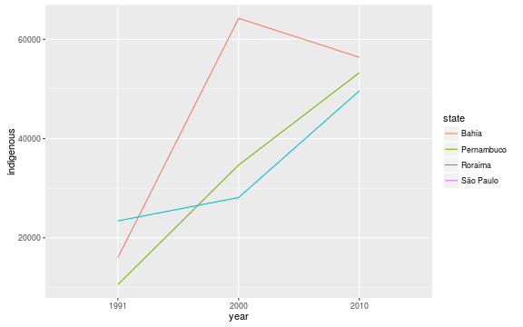
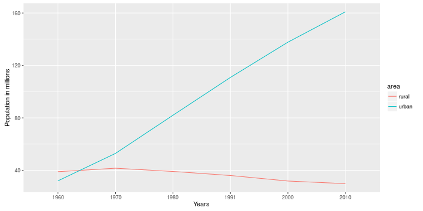

## Brazilian Census

Each 10 years, the IBGE institute does a survey around all Brazilian territory, in order to offer data and information over social-economics conditions of the people. This data serves to help the politicians and public authorities infer what actions implement on public agenda.  
  
In my application, i used the data of the 2010 Census about where  the urban, rural and indigenous population are distributed on Brazil and compared them with the older years.  

The Brazil nation is splitted into 27 states as present in the application.  

--- .class #id 

## Indigenous Census

With the Indigenous Census, it is possible check how they are spread along the territory, on the demographic map, by 3 different decades. On the stack area chart we see if the population are growing or diminishing. For each of the activities is possible choose among the 27 brazilian states, and check the area as isolated case.


```
##    year indigenous growth_rate
## 1: 1991     294131          NA
## 2: 2000     734131      149.59
## 3: 2010     817963       11.42
```

The table above show us how much the indigenous population has be growing. The `growth_rate` column is in percentage terms, we see a high enlargement, maybe it not just invoked by real population growth, but the increase on census accuracy and  in the own indian declaration about its race.

--- .class #id 

## Indigenous Census
Checking specific states, it is possible to note distinct moves on the indigenous growth. When some states keep the growth, others seems to diminish of native presence, maybe it can be associate to migratory moves.




--- .class #id 

## Urban-Rural Census

The Urban-Rural Census evaluates the brazilian population distributed between these two factors. If join both, i can see the whole population along the decades.


```
##    years       pop growth_rate
## 1:  1960  70992343          NA
## 2:  1970  94508583       33.13
## 3:  1980 121150573       28.19
## 4:  1991 146917459       21.27
## 5:  2000 169590693       15.43
## 6:  2010 190755799       12.48
```

--- .class #id 

## Urban-Rural Census

I can verify the population growth along the urban and rural factors.



Here, we can perceive that the urban still growing, but the rural are decreasing since the 70's.

--- .class #id 
